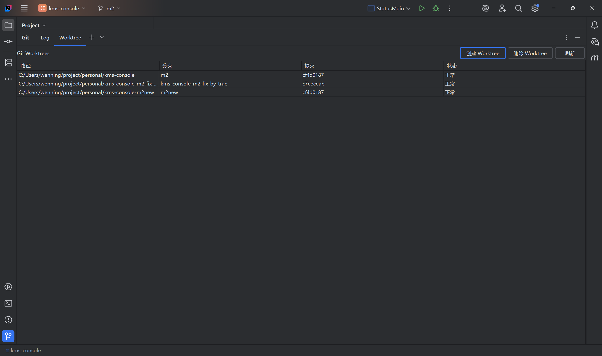
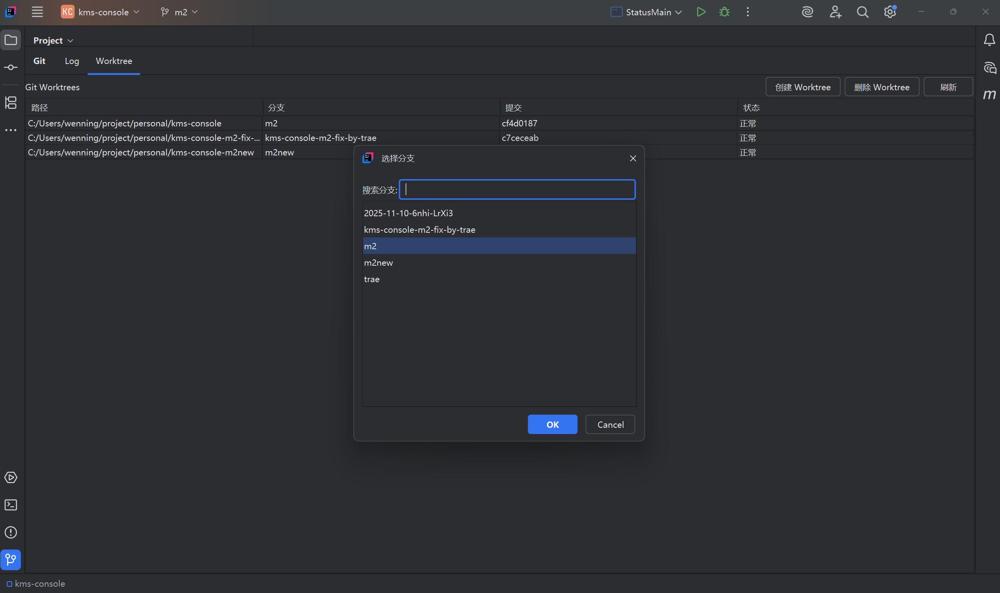
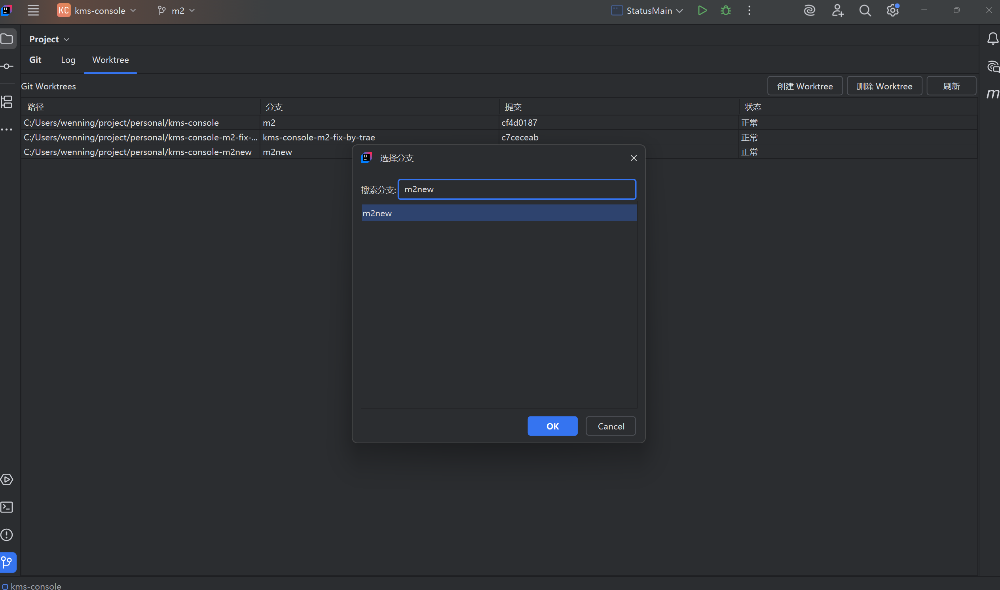

# Another Git Worktree

[中文文档](README.zh-CN.md) | English

A Git Worktree management plugin for IntelliJ IDEA that provides a visual interface to manage Git worktrees.

## Features

### 1. Worktree List Display
- Adds a "Worktree" tab in the Version Control tool window
- Displays detailed information for all worktrees:
  - Path
  - Branch name
  - Commit hash (first 8 characters)
  - Status (normal/locked)
- Manual refresh support

### 2. Double-Click to Open Worktree
- Double-click any table row to open the corresponding worktree directory in IDEA
- Smart detection: if the project is already open, automatically switches to the corresponding window
- Prevents duplicate project openings

### 3. Create Worktree
- "Create Worktree" button in the toolbar
- **Branch Selection Dialog**:
  - Displays all available branches
  - Real-time search filtering (case-insensitive)
  - Keyboard navigation support (arrow keys)
  - Double-click for quick selection
  - Defaults to current branch
  - Supports entering new branch names
- Path Input Dialog:
  - Auto-suggests default path (project directory sibling + branch name)
  - Supports custom paths
- Auto-refresh list after creation

### 4. Delete Worktree
- **Two deletion methods**:
  - "Delete Worktree" button in the toolbar
  - Right-click context menu "Delete Worktree" option
- Confirmation dialog before deletion
- Displays path and branch information to be deleted
- Uses `--force` option to handle uncommitted changes
- Auto-refresh list after deletion

### 5. Context Menu
- Right-click table rows to show context menu
- **Menu Options**:
  - Open Directory: Opens the worktree in IDEA
  - Delete Worktree: Deletes the selected worktree

## Installation

### Option 1: Install from JetBrains Marketplace (Recommended)

1. Open IntelliJ IDEA
2. Go to **File** → **Settings** → **Plugins** (or **IntelliJ IDEA** → **Preferences** → **Plugins** on macOS)
3. Click **Marketplace** tab
4. Search for "Another Git Worktree"
5. Click **Install** and restart IDEA

### Option 2: Download from GitHub Releases

1. Go to [Releases](https://github.com/n-wen/another_gitworktree/releases)
2. Download the latest `another_gitworktree-*.zip` file
3. Install the plugin:
   - Open IntelliJ IDEA
   - Go to **File** → **Settings** → **Plugins** (or **IntelliJ IDEA** → **Preferences** → **Plugins** on macOS)
   - Click the ⚙️ icon → **Install Plugin from Disk...**
   - Select the downloaded zip file
   - Click **OK** and restart IDEA

### Option 3: Build from Source

1. Clone the repository:
```bash
git clone https://github.com/n-wen/another_gitworktree.git
cd another_gitworktree
```

2. Build the plugin:
```bash
./gradlew buildPlugin
```

3. Install the plugin:
   - Open IntelliJ IDEA
   - Go to **File** → **Settings** → **Plugins** → ⚙️ → **Install Plugin from Disk...**
   - Select `build/distributions/another_gitworktree-*.zip`

## Usage

### Viewing Worktree List
1. Open the Version Control tool window (Alt+9 or View → Tool Windows → Version Control)
2. Switch to the "Worktree" tab
3. View detailed information for all worktrees

**Note**: The Worktree tab is non-closeable, ensuring you can always access it.

### Creating a Worktree
1. Click the "Create Worktree" button in the toolbar
2. In the branch selection dialog:
   - Enter a branch name in the search box to filter
   - Select a branch from the list, or enter a new branch name
   - Double-click a list item or click OK to confirm
3. Enter the worktree directory path (or use the default path)
4. Confirm creation

### Opening a Worktree
- **Double-click** a table row to open the corresponding worktree directory in IDEA
- **Right-click** a row and select "Open Directory"

### Deleting a Worktree
- **Method 1**: Select a table row and click the "Delete Worktree" button in the toolbar
- **Method 2**: Right-click a table row and select "Delete Worktree"
- Review the information in the confirmation dialog before confirming

### Refreshing the List
- Click the "Refresh" button in the toolbar to manually refresh the worktree list
- List automatically refreshes after creating or deleting a worktree

## Technical Features

- **Thread Safety**: File system operations execute on background threads, UI operations on EDT
- **Error Handling**: Comprehensive error handling and user notifications
- **User Experience**:
  - Table editing disabled to prevent accidental modifications
  - Smart path suggestions
  - Confirmation dialogs to prevent accidental deletions
  - Real-time search filtering
- **Git Integration**: Uses Git4Idea plugin API

## Development

### Run Development Environment
```bash
./gradlew runIde
```

### Build Plugin
```bash
./gradlew buildPlugin
```

### Compile Check
```bash
./gradlew compileKotlin
```

## System Requirements

- IntelliJ IDEA 2023.3+ or other IntelliJ Platform IDEs
- Git 2.15+ (supports `git worktree` command)

## Dependencies

- Kotlin
- IntelliJ Platform SDK
- Git4Idea Plugin

## Contributing

Issues and Pull Requests are welcome!

### Development Setup

1. Fork the repository
2. Create your feature branch (`git checkout -b feature/amazing-feature`)
3. Commit your changes (`git commit -m 'Add some amazing feature'`)
4. Push to the branch (`git push origin feature/amazing-feature`)
5. Open a Pull Request

## License

[MIT License](LICENSE)

## Changelog

### v1.0.5 (Latest)
- ✨ Improved branch selection logic for remote branches
- 🔄 Optimized branch validation by removing unnecessary remote branch checks
- 🧹 Cleaned up branch names by removing special characters (*, +)
- 📝 Simplified branch handling in worktree creation process
- 🎯 Enhanced user experience when selecting remote branches

### v1.0.2
- ✨ Extended compatibility to IDEA 2023.3+ (no upper limit)
- 🛡️ Fixed: Main worktree can no longer be deleted (button disabled, menu item disabled)
- 🔄 Improved: Auto-close open projects before deleting their worktree
- 📁 Enhanced: Better handling of locked directories during deletion
- ⚠️ Better: More informative error messages for worktree operations
- 🎯 Fixed: Worktree list now loads automatically on first open (no manual refresh needed)

### v1.0.1
- ✨ Fixed: Changed all UI text to English for international users
- 🌐 Improved: Standardized language across the entire interface

### v1.0.0
- ✨ Initial release
- ✨ Worktree list display
- ✨ Double-click to open worktree directory
- ✨ Create worktree functionality
- ✨ Delete worktree functionality
- ✨ Context menu support
- ✨ Branch search filtering
- 🐛 Fixed EDT slow operation warnings
- 🎨 Optimized UI and interaction experience

## Screenshots

### Worktree List


### Create Worktree


### Branch Selection Dialog


## FAQ

### Q: How do I view plugin logs?
A: In IDEA, open Help → Show Log in Explorer and check the idea.log file.

### Q: Why can't I see the Worktree tab?
A: Ensure your project is a Git repository and the Git plugin is enabled.

### Q: Are files deleted when I remove a worktree?
A: `git worktree remove` removes the Git association of the worktree. Whether files are deleted depends on Git's behavior. It's recommended to backup important data before deletion.

### Q: Can I create worktrees based on remote branches?
A: Yes, enter the full remote branch name in the branch selection dialog (e.g., `origin/feature-branch`).

## Feedback & Support

For questions or suggestions:
- Submit an [Issue](https://github.com/n-wen/another_gitworktree/issues)
- Email: n-wen@outlook.com

## Acknowledgments

Thanks to JetBrains for providing the powerful IntelliJ Platform SDK!

## Star History

[](https://star-history.com/#n-wen/another_gitworktree&Date)
